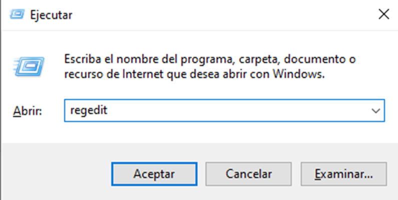
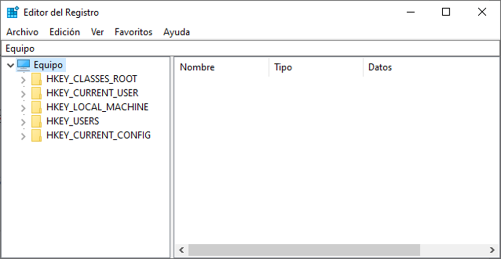
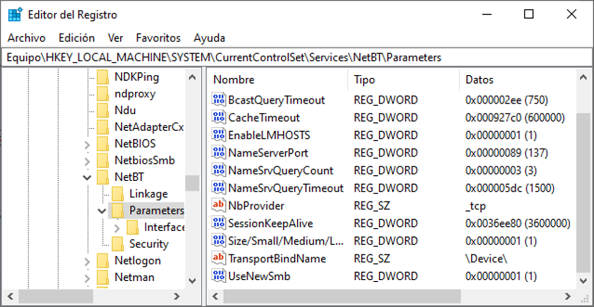
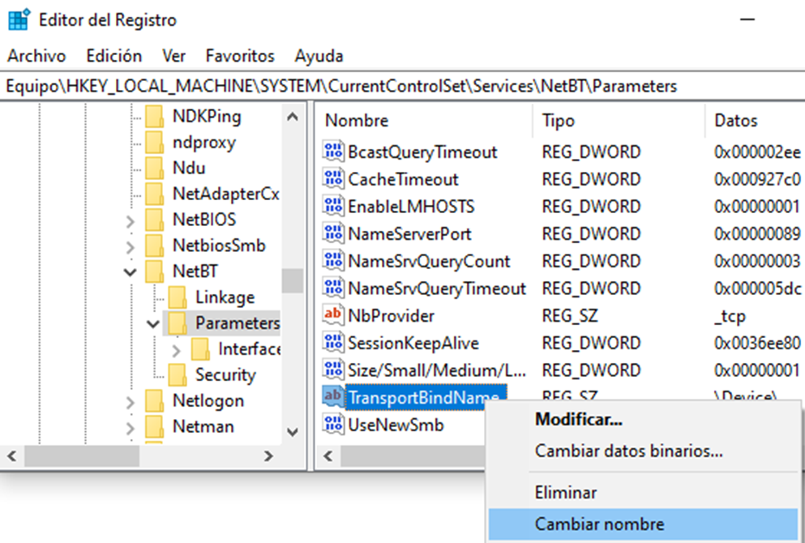
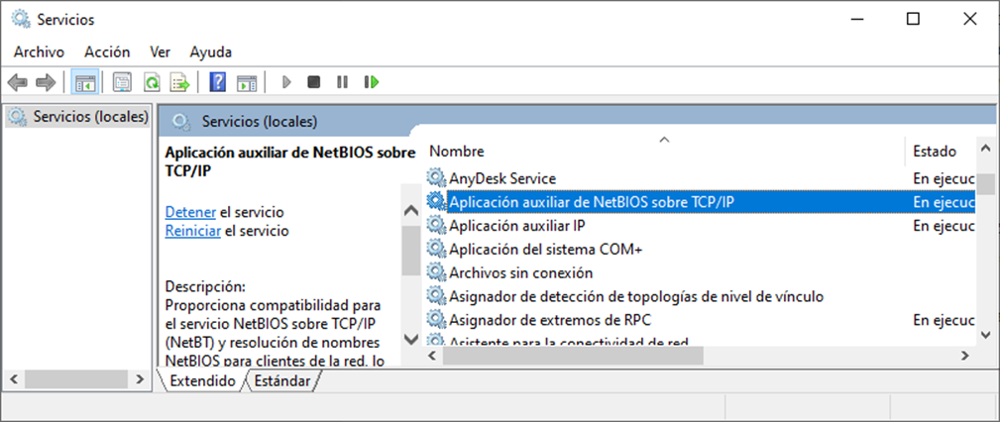
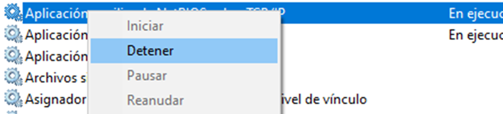
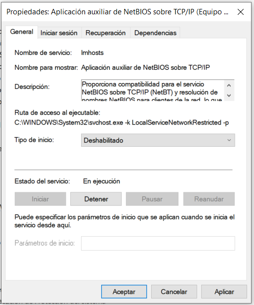

# Puertos y servicios comunes en cliente Windows

Los equipos clientes Windows disponen, por defecto, de varios puertos abiertos para permitir escuchar a los servicios que corren. Muchos de estos servicios no nos interesa que estén funcionando, ya que si no los utilizamos pueden suponer una fuga de información e incluso puertas para que un atacante acceda a nuestro equipo. Por lo que nuestra principal preocupación en la configuración de los sistemas informáticos debe ser:

## 
Reducción de la superficie de ataque, empezando por la reducción de servicios

Los más conocidos son los siguientes:

**23 (TCP).** Puerto Telnet. Es utilizado para comunicación entre sistemas, anterior a SSH, en versiones anteriores a Windows 10 se encontraba activado por defecto.

**139 (TCP).** Puerto NETBIOS. Este puerto permite a los equipos de la red local comunicarse entre sí e identificarse mediante los nombres NETBIOS.

**445 (TCP).** Puerto SMB. Permite compartir información entre equipos. Al compartir una carpeta en la red se realizará sobre este puerto.

**995 (TCP).** Puerto POP3. Si disponemos de un cliente de correo en nuestro equipo, es probable que lo tengamos configurado con POP3 y, por lo tanto, tengamos este puerto abierto en nuestro equipo.

**5357 (TCP).** Puerto HTTPAPI de Microsoft. Este puerto se activa al permitir ser encontrado por otros equipos, por ejemplo cuando nos conectamos por primera vez a una nueva red o en caso de marcar la red como de Trabajo u Hogar.

**3389 (TCP).** Puerto RDP. Es el puerto por defecto que permite a un usuario externo acceder de forma remota al equipo pudiendo controlarlo gráficamente desde otro equipo.

---

??? note "Bloquear puertos NetBIOS y SMB:"
    Comenzamos por deshabilitar el uso de los puertos 139 (NetBIOS) y 445 (SMB).
    
    Para ello accedemos a la ventana de Ejecutar con ***Windows + R*** y escribimos ***regedit:***

    

??? note "Con esto, accederemos al Editor de Registro de nuestro equipo:"
    

??? note "Una vez dentro, iremos a la siguiente ruta:"
    ### HKEY_LOCAL_MACHINE\SYSTEM\CurrentControlSet\Services\NetBT\Parameters
    

??? note "Ahora editaremos la cadena con nombre **TransportBindName** a **TransportBindName_**"
    
    Con este cambio de nombre lo que conseguimos es mantener la entrada en el Registro de Windows pero ya no es una instrucción reconocida.

??? note "Una vez cambiado este parámetro, deberemos reiniciar nuestra máquina para que se apliquen los cambios."
    Ahora tendremos que deshabilitar el servicio, para ello, vamos a siguiente ruta:
    **Panel de control > Herramientas Administrativas > Servicios > Aplicación auxiliar de NetBIOS sobre TCP/IP.**
    

??? note "Y detenemos el servicio:"
    
    Para que esta configuración sea permanente deberemos ir a las propiedades del servicio y seleccionar "Deshabilitado" en la opción "Tipo de inicio" y aplicar los cambios:
    

